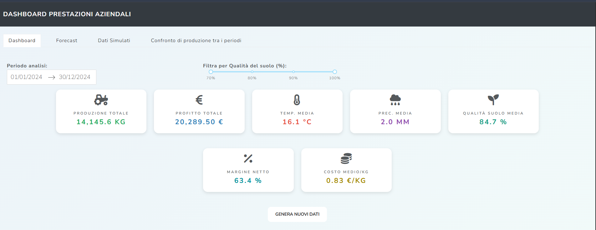
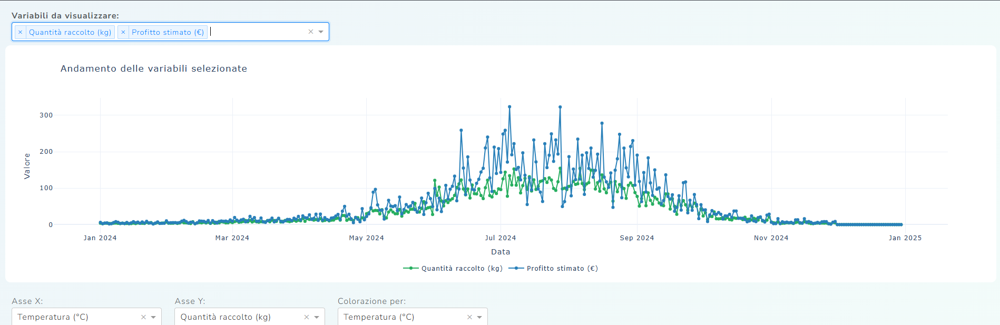
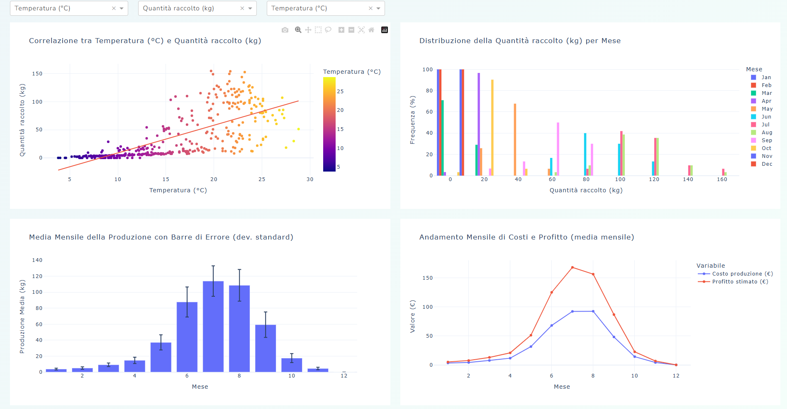
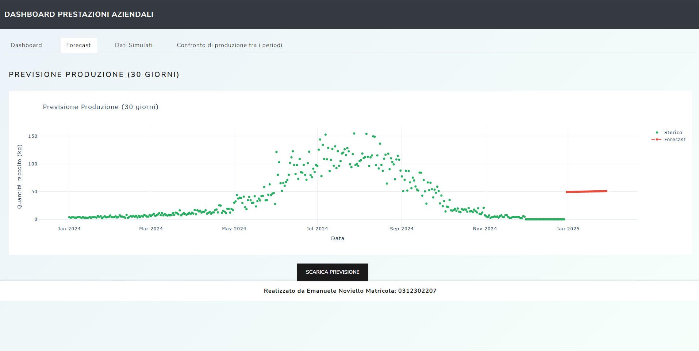
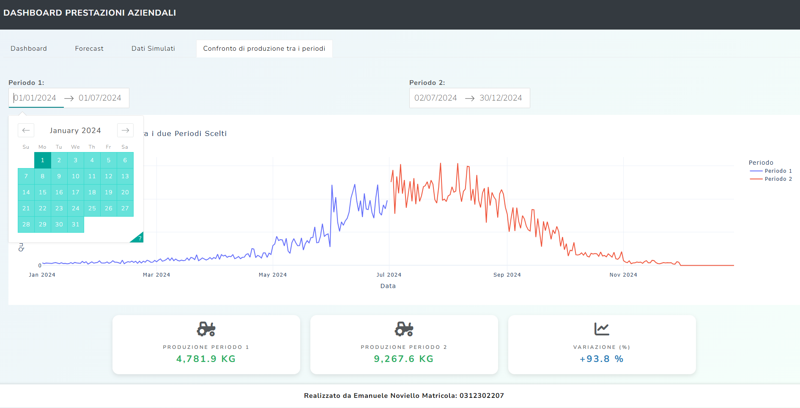

# 📊 ProjectWork – Dashboard Interattiva per Aziende Agricole

Questa repository contiene il codice sorgente di una dashboard interattiva realizzata in Python, sviluppata per supportare le decisioni strategiche e operative in ambito agricolo. L’applicazione è concepita nel contesto dell’Agricoltura 4.0, integrando dati simulati relativi a variabili ambientali, produttive ed economiche, e offrendo funzionalità avanzate come forecast, confronto periodico, e generazione di report in PDF e CSV.

---

## 📁 Struttura della Repository

Il codice sorgente è organizzato in maniera modulare in quattro file principali:

- **main.py**: Punto di ingresso dell'applicazione; crea l'istanza di Dash, imposta il layout e importa le callback.
- **components.py**: Definisce l'interfaccia utente, organizzando i componenti in schede (Dashboard, Forecast, Dati Simulati, Confronto Periodi), inclusi controlli interattivi, grafici (line, scatter, histogram, box plot) e KPI card.
- **callbacks.py**: Contiene le funzioni di callback che aggiornano dinamicamente grafici, KPI, tabelle e gestiscono il download dei dati e la generazione dei report.
- **utils.py**: Fornisce il motore di generazione dei dati simulati (`genera_dati_simulati()`) e la funzione `create_kpi_card()` per creare schede informative uniformi.

---

## ⚙️ Funzionalità Principali

- **Visualizzazione Interattiva**: Grafici dinamici che si aggiornano in tempo reale in base ai filtri (range di date, qualità del suolo, selezione variabili).
- **KPI Card**: Presentazione sintetica degli indicatori chiave (produzione, profitto, temperatura media, ecc.).
- **Forecast a 30 Giorni**: Previsione della produzione basata su regressione lineare.
- **Confronto Periodico**: Analisi comparativa di due intervalli temporali.
- **Download Dati e Report**: Esportazione dei dati filtrati in CSV ed esportazione dei report in PDF.

---

## 🌾 Anteprima dell'applicazione

### Dashboard Principale  
Visualizzazione dei KPI, grafici interattivi e controlli di filtraggio.

---

### Forecast della Produzione  
Previsione a 30 giorni con regressione lineare.

---

### Confronto Periodico  
Comparazione delle performance tra due intervalli temporali.

---

## 🔗 Repository GitHub

Il codice completo è disponibile qui:  
👉 [https://github.com/enoviell/ProjectWork](https://github.com/enoviell/ProjectWork)

---

## 🧪 Requisiti

- Python 3.9+
- Dash
- Plotly
- pandas, numpy
- pdfkit, wkhtmltopdf

